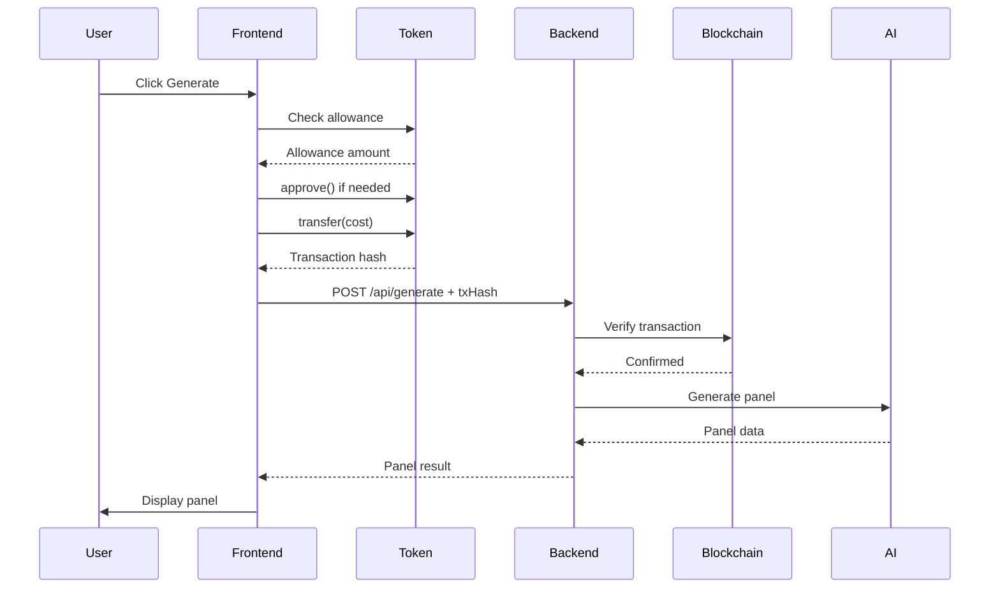

# PanelForge

AI-powered manga panel generator with Web3 micropayments. Transform your stories into manga art using custom token payments.

## Features

- 🎨 **AI Manga Generation** - Turn story prompts into manga-style panels
- 💎 **Web3 Native** - Pay with custom ERC20 tokens via wallet connect
- ⚡ **HTTP 402 Middleware** - Decentralized payment verification
- 🌙 **Modern UI** - Dark theme with manga aesthetics + glassmorphism
- 📱 **Responsive** - Works on all devices

## Tech Stack

| Layer | Tech |
|-------|------|
| **Frontend** | Next.js 14, React, TailwindCSS |
| **Web3** | wagmi, viem, RainbowKit |
| **Backend** | Express.js, HTTP 402 middleware |
| **Payments** | On-chain ERC20 verification |
| **AI** | Anthropic Claude (text), DALL-E (image - future) |
| **Deploy** | Vercel (frontend + backend serverless) |

## Project Structure

```
panelforge/
├── frontend/          # Next.js app (landing + app interface)
├── backend/           # Express API with x402 middleware
└── packages/shared/   # Shared types & schemas
```

## Quick Start

### Prerequisites

- Node.js 20+
- pnpm 8+
- MetaMask or compatible Web3 wallet

### Installation

```bash
# Install dependencies
pnpm install

# Set up environment variables
cp .env.example .env.local
# Fill in: NEXT_PUBLIC_TOKEN_ADDRESS, ANTHROPIC_API_KEY, etc.

# Run dev servers
pnpm dev
```

Frontend: http://localhost:3000
Backend: http://localhost:4000

### Build & Deploy

```bash
# Build all packages
pnpm build

# Deploy frontend to Vercel
cd frontend && vercel deploy --prod

# Deploy backend to Vercel
cd backend && vercel deploy --prod
```

## Environment Variables

### Frontend (.env.local)
```
NEXT_PUBLIC_API_URL=http://localhost:4000
NEXT_PUBLIC_TOKEN_ADDRESS=0x...
NEXT_PUBLIC_BACKEND_ADDRESS=0x...
NEXT_PUBLIC_CHAIN_ID=8453
```

### Backend (.env)
```
PORT=4000
ANTHROPIC_API_KEY=sk-ant-...
BACKEND_WALLET_ADDRESS=0x...
TOKEN_ADDRESS=0x...
GENERATION_COST=10000000000000000000
```

## User Flow

1. **Connect Wallet** - User connects MetaMask/WalletConnect
2. **Check Balance** - App displays token balance
3. **Input Story** - User writes manga scene description
4. **Payment** - Auto-approve and transfer tokens to backend
5. **Generate** - Backend verifies payment, generates panel via AI
6. **Display** - Manga panel shown with download/share options

## Payment (x402) Flow



## Roadmap

- [x] Wallet connect integration
- [x] HTTP 402 payment middleware
- [x] Basic landing + app pages
- [ ] Actual AI manga panel generation (DALL-E/Midjourney)
- [ ] User history & gallery
- [ ] Token deployment & faucet
- [ ] Social sharing
- [ ] Mobile app

## License

MIT
